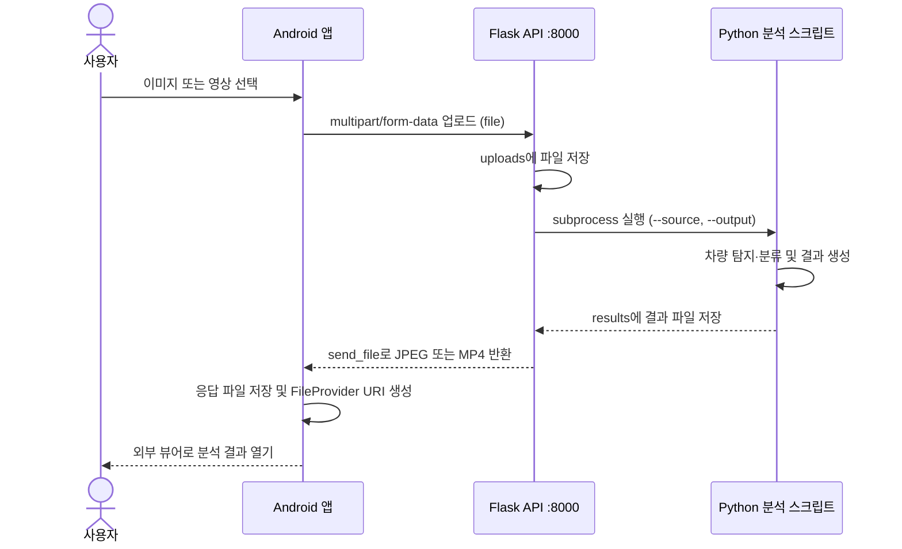

# AI 기반 차량 분석 시스템

AI-Hub 데이터를 활용해 차량 분류 모델을 직접 학습하고, Android 앱에서 **온디바이스 추론과 서버 기반 이미지·영상 분석**을 사용할 수 있도록 구현한 프로젝트입니다.

Kotlin 앱, Flask API, 차량 탐지·분류 모델을 연결해 **파일 업로드 → AI 분석 → 결과 파일 반환 → 앱에서 확인**하는 흐름을 구성했습니다.

## 시연 영상

<video src="https://github.com/dolele092-source/vehicle-analysis-system/raw/refs/heads/main/docs/result_test.mp4" controls="controls" width="960"></video>

차량 분석 결과 시연 영상입니다. 재생 버튼을 눌러 확인할 수 있습니다.

## 직접 수행한 작업

- AI-Hub 데이터를 활용한 차량 분류 모델 학습 및 추론 코드 구현
- Google Colab H100 환경에서 GPU 학습 수행
- 학습 모델의 모바일 적용을 위한 변환 작업 및 TensorFlow Lite 연동
- Kotlin·CameraX 기반 Android 카메라 화면과 분석 결과 표시 구현
- Flask 서버의 이미지·영상 업로드 및 분석 결과 반환 API 구현
- Retrofit을 통한 Android–서버 통신 구현
- 분류 오류 피드백 및 긴급 이미지 분석 기능 구현

기존 모델 아키텍처와 라이브러리를 활용했으며, 직접 학습한 차량 분류 모델과 사전학습 탐지 모델을 조합했습니다.

## 서버는 어떻게 동작하나요?



### 1. Android에서 파일 전송

사용자가 갤러리에서 이미지나 영상을 선택하면 앱이 파일을 준비하고 Retrofit으로 전송합니다. 요청은 `multipart/form-data` 형식이며, 파일 필드 이름은 `file`입니다.

통신 인터페이스: [ApiService.kt](term2/app/src/main/java/com/yonghyeok/term2/network/ApiService.kt)

### 2. Flask에서 요청 수신 및 분석 실행

[server.py](ai_code/test/server.py)는 요청 파일을 `uploads/`에 저장하고, `subprocess.run()`으로 입력 경로와 출력 경로를 분석 스크립트에 전달합니다.

| API | 처리 스크립트 | 응답 |
| --- | --- | --- |
| `POST /analyze/video` | `detect2.py` | 분석 결과 MP4 |
| `POST /analyze/image` | `detectimg.py` | 분석 결과 JPEG |
| `POST /analyze/emergency` | `emergency_detect.py` | 긴급 이미지 분석 결과 JPEG |
| `POST /feedback` | 서버에서 이미지·라벨 저장 | 처리 완료 메시지 |

현재 구현은 요청 안에서 분석 완료를 기다리는 **동기 처리 방식**입니다. 작업 큐를 두거나 작업 ID를 반환하는 구조는 아닙니다.

### 3. 영상 분석 파이프라인

[detect2.py](ai_code/test/detect2.py)는 다음 순서로 영상을 처리합니다.

1. OpenCV로 영상을 프레임 단위로 읽습니다.
2. YOLOv8n의 추적 기능으로 차량 영역과 추적 ID를 얻습니다.
3. 탐지된 차량 영역을 잘라 EfficientNet-B4 분류기에 입력합니다.
4. 추적 ID별 분류 결과를 보관하고, 갱신 간격과 신뢰도 조건에 따라 라벨을 갱신합니다.
5. 일부 프레임에서 TFLite 번호판 탐지를 수행하고 탐지 영역에 모자이크를 적용합니다.
6. 차량 영역·추적 ID·분류 라벨·신뢰도를 표시한 결과 영상을 저장합니다.

영상 추론 코드에서는 `.half()`와 `half=True`를 사용합니다. 이는 서버 추론의 반정밀도 사용이며, 모든 모바일 모델이 FP16으로 변환되었다는 뜻은 아닙니다. 번호판 탐지는 프레임 간격을 두고 수행하므로 모든 프레임의 번호판 비식별화를 보장하지 않습니다.

### 4. 결과를 앱으로 반환

분석이 끝나면 Flask가 결과 파일을 `send_file()`로 반환합니다. 앱은 Retrofit의 `ResponseBody`를 로컬 파일로 저장하고, `FileProvider`와 `ACTION_VIEW`를 이용해 결과를 열어 줍니다.

앱 처리 코드: [MainActivity.kt](term2/app/src/main/java/com/yonghyeok/term2/MainActivity.kt)

## 온디바이스 분석

서버 분석과 별도로, 휴대폰 카메라 입력을 기기 내부에서 처리하는 경로를 구현했습니다.

```text
CameraX 카메라 입력
    → TFLite 차량 탐지
    → 차량 영역 추출
    → TFLite 차량 분류
    → 화면에 영역 및 분류 결과 표시
```

[CameraActivity.kt](term2/app/src/main/java/com/yonghyeok/term2/CameraActivity.kt)에서 `vehicle_detect.tflite`와 `vehicle_class.tflite`를 로드하고, `classes.txt`를 이용해 출력값을 라벨로 변환합니다. GPU Delegate 적용 코드도 포함되어 있습니다.

## 데이터 및 모델 학습

| 항목 | 내용 |
| --- | --- |
| 데이터 | AI-Hub 자동차 차종/연식/번호판 인식용 영상 |
| 데이터셋 전체 규모 | 약 60만 장 — 차량 이미지 50만 장, 번호판 이미지 10만 장 |
| 학습 환경 | Google Colab, NVIDIA H100 GPU |
| 차량 분류 | EfficientNet-B4 기반 분류 모델 직접 학습 |
| 차량 탐지 | 사전학습 YOLOv8n 활용 |
| 모바일 적용 | TFLite 모델을 Android 앱의 추론 코드와 연결 |

출처: [AI-Hub 데이터 소개](https://aihub.or.kr/aihubdata/data/view.do?currMenu=115&topMenu=100&aihubDataSe=data&dataSetSn=172)

약 60만 장 규모의 데이터셋을 활용해 모델 학습을 수행했습니다. 이 수치는 데이터셋 전체 규모이며, 개별 분류 모델의 실제 학습 이미지 수나 학습·검증·테스트 분할 수를 의미하지 않습니다. 학습 환경은 개발 당시 작업 내용을 기준으로 작성했습니다.

모바일 실행을 위한 모델 변환을 진행하고 TFLite 결과물을 앱에 연결했습니다. 정확한 ONNX 변환 경로와 모바일 모델별 FP16 적용 범위는 변환 기록이 확인되지 않아 기재하지 않았습니다. 학습 노트북과 평가 로그는 이 저장소에 포함되어 있지 않으며, 별도로 검증한 정확도·FPS 수치를 제시하지 않습니다.

## 기술 스택

| 구분 | 기술 |
| --- | --- |
| Android | Kotlin, CameraX, TensorFlow Lite, Retrofit |
| 서버 | Python, Flask, subprocess |
| AI | PyTorch, Torchvision, EfficientNet-B4, Ultralytics YOLOv8n |
| 영상 처리 | OpenCV, NumPy, Pillow |
| 학습 환경 | Google Colab, NVIDIA H100 |

현재 공개 코드에서 확인되는 실행 구성은 Flask의 `0.0.0.0:8000` 직접 실행입니다. Docker·Nginx 배포 설정은 보관된 프로젝트에서 확인되지 않아 이 저장소의 구성으로 포함하지 않았습니다.

## 저장소 구조

```text
.
├── README.md
├── term2/                     # 원본 Android 프로젝트 구조 유지
│   └── app/src/main/
├── ai_code/
│   ├── test/                  # 서버·추론 작업 폴더 (자동화 테스트 폴더 아님)
│   │   ├── server.py
│   │   ├── detect2.py
│   │   ├── detectimg.py
│   │   └── emergency_detect.py
│   ├── tflite.py              # TFLite 모델 추론 확인
│   ├── check_model.py
│   └── classes.txt
└── docs/
    └── result_test.mp4         # 시연 영상
```

기존 소스 파일은 변경하지 않고 공개할 코드와 시연 영상만 선별했습니다. 외부 참고 코드 묶음, 데이터셋, 모델 바이너리, 빌드 산출물 및 개인 환경 설정은 포함하지 않았습니다.

## 실행 환경과 필요한 파일

이 저장소는 구현 코드를 공개한 포트폴리오입니다. 모델 바이너리를 별도로 준비해야 추론 기능을 실행할 수 있습니다.

- Android: Android Studio와 프로젝트 Gradle 설정에 맞는 SDK가 필요합니다. 최소 지원 버전은 API 24입니다.
- 온디바이스 모델: `term2/app/src/main/assets/`에 `vehicle_detect.tflite`, `vehicle_class.tflite`가 필요합니다.
- 서버 모델: `ai_code/test/`에 `yolov8n.pt`, `vehicle_classifier_A100_final_best.pth`, `label_to_idx_final.pth`, `yolov5_0901-fp16.tflite`가 필요합니다. 파일명은 기존 코드 기준입니다.
- Python: Flask, PyTorch, Torchvision, Ultralytics, TensorFlow, OpenCV, NumPy, Pillow 및 추적 기능에 필요한 의존성이 필요합니다. 정확한 패키지 버전은 고정되어 있지 않습니다.
- 서버 실행: 필요한 모델과 의존성을 준비한 후 `ai_code/test/`에서 `python server.py`를 실행합니다.
- 앱 연결: [RetrofitClient.kt](term2/app/src/main/java/com/yonghyeok/term2/network/RetrofitClient.kt)의 서버 주소를 실제 환경에 맞춰야 합니다.

서버 코드는 개발용 `debug=True` 설정과 로컬 경로를 포함한 당시 구현을 보존했습니다. 공개 인터넷 운영용 배포 구성이 아니며 CPU 추론 및 모든 기기에서의 실행은 검증하지 않았습니다. 긴급 이미지 분석 API에는 고정 좌표를 사용하는 부분이 남아 있습니다.

## 참고 자료 및 기여 범위

- [AI-Hub 자동차 차종/연식/번호판 인식용 영상](https://aihub.or.kr/aihubdata/data/view.do?currMenu=115&topMenu=100&aihubDataSe=data&dataSetSn=172)
- 차량 탐지와 분류에 기존 YOLOv8n 및 EfficientNet-B4 아키텍처를 활용했습니다.
- 외부 제공 모델 소스코드는 참고했으며, 해당 원본 구현을 직접 작성한 코드로 소개하지 않습니다.
- 본 프로젝트의 기여는 차량 분류 모델 학습, 추론 파이프라인, Android 앱 및 서버 API 연동에 있습니다.
